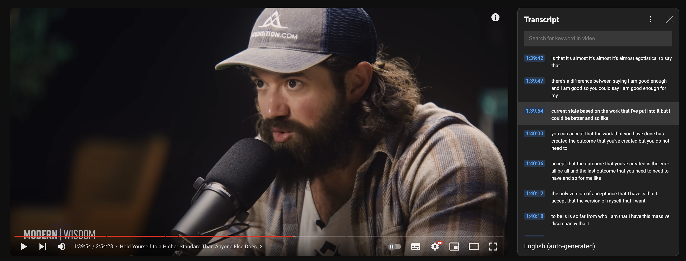
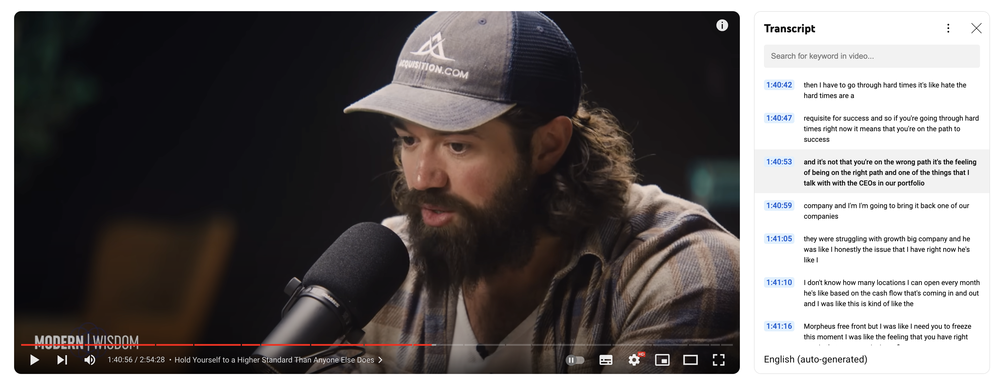

# Overview

A simple chrome extension that lets you search within the YouTube video's transcript to be able to navigate timestamps smoothly.

## Features

- [x] Upon clicking the extension it should load correctly
- [ ] Upon switching between videos the transcript should corresponding to the right video and tim`estamps should be navigable
- [ ] Extension should start running on startup and whenever a youtube video url is seen should enable the transcript window
- [x] Supports both light and dark mode

## UI Screenshots

